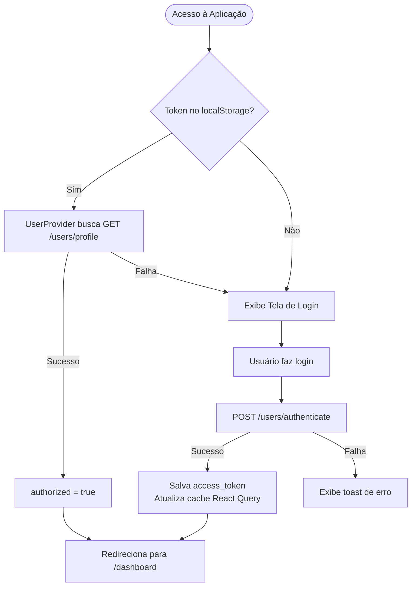

# 📦 vero-web — Documentação Técnica

---

## Índice

1. [Visão Geral](#1-visão-geral)
2. [Arquitetura / Estrutura de Pastas](#2-arquitetura--estrutura-de-pastas)
3. [Stack Tecnológico](#3-stack-tecnológico)
4. [Scripts Disponíveis](#4-scripts-disponíveis)
5. [Instalação e Configuração](#5-instalação-e-configuração)
6. [Como Adicionar uma Nova Feature](#6-como-adicionar-uma-nova-feature)
7. [Autores](#7-autores)

---

## 1. Visão Geral

**vero-web** é uma aplicação web moderna construída com **React 19**, **TypeScript** e **Vite**, voltada para gerenciamento de usuários com autenticação segura via JWT. A aplicação inclui fluxos completos de **login**, **recuperação de senha** e **redefinição de senha**, além de uma área interna protegida (dashboard).

O projeto segue princípios de arquitetura limpa, separação de responsabilidades e tipagem rigorosa em toda a base de código. Utiliza o ecossistema TanStack para roteamento e gerenciamento de estado assíncrono, garantindo escalabilidade e alta performance.

### Características Principais

- 🔐 Autenticação via JWT com persistência em `localStorage`
- 🌐 Roteamento tipado e baseado em arquivo com TanStack Router
- 🎨 Suporte a modo claro/escuro com `next-themes`
- ✅ Validação de formulários com React Hook Form + Zod
- 🧩 Componentes de UI acessíveis com Radix UI / shadcn
- ⚡ Variáveis de ambiente validadas em tempo de execução com Zod
- 🔔 Notificações toast com `sonner`

---

## 2. Arquitetura / Estrutura de Pastas

```
vero-web/
├── public/                        # Arquivos estáticos públicos
├── src/
│   ├── api/                       # Funções de integração com a API REST
│   │   ├── authenticate.ts        # Login — POST /users/authenticate
│   │   ├── get-profile.ts         # Perfil do usuário — GET /users/profile
│   │   ├── request-reset-password.ts  # Solicitar redefinição — POST /users/forgot-password
│   │   └── reset-password.ts      # Redefinir senha — POST /users/reset-password
│   │
│   ├── assets/                    # Assets estáticos (imagens, fontes, etc.)
│   │
│   ├── components/
│   │   ├── ui/                    # Componentes de UI reutilizáveis (shadcn)
│   │   │   ├── button.tsx
│   │   │   ├── field.tsx
│   │   │   ├── input.tsx
│   │   │   ├── label.tsx
│   │   │   ├── separator.tsx
│   │   │   └── sonner.tsx
│   │   ├── loading-screen.tsx     # Tela de carregamento global
│   │   └── theme-provider.tsx     # Provedor de tema (claro/escuro)
│   │
│   ├── config/
│   │   └── storage/               # Abstração sobre localStorage/sessionStorage
│   │
│   ├── contexts/
│   │   ├── auth.tsx               # Contexto de autenticação (login, logout, estado)
│   │   └── user.tsx               # Contexto do usuário (dados do perfil, autorização)
│   │
│   ├── env/
│   │   └── index.ts               # Schema de validação das variáveis de ambiente (Zod)
│   │
│   ├── lib/
│   │   ├── axios.ts               # Instância configurada do Axios
│   │   ├── react-query.ts         # Instância do QueryClient
│   │   └── utils.ts               # Utilitários gerais (ex: cn para classes)
│   │
│   ├── routes/
│   │   ├── __root.tsx             # Layout raiz — define contexto do router
│   │   ├── _auth/                 # Grupo de rotas públicas (não autenticado)
│   │   │   ├── layout.tsx         # Layout de autenticação (redireciona se autenticado)
│   │   │   ├── sign-in/           # Página de login
│   │   │   ├── reset-password/    # Página de solicitação de redefinição de senha
│   │   │   └── change-password/   # Página de redefinição de senha (via token)
│   │   └── _app/                  # Grupo de rotas protegidas (autenticado)
│   │       ├── layout.tsx         # Layout da aplicação (redireciona se não autenticado)
│   │       └── dashboard/         # Página principal do dashboard
│   │
│   ├── utils/
│   │   ├── constants.ts           # Constantes globais (chaves do localStorage)
│   │   ├── errors.ts              # Mensagens de erro padronizadas para validações
│   │   ├── index.ts               # Re-exportações dos utilitários
│   │   └── validation-schemas.ts  # Schemas Zod reutilizáveis para formulários
│   │
│   ├── global.d.ts                # Tipos globais TypeScript (ex: User, ErrorResponse)
│   ├── index.css                  # Estilos globais e tokens de design (Tailwind)
│   ├── main.tsx                   # Ponto de entrada da aplicação
│   └── routeTree.gen.ts           # Árvore de rotas gerada automaticamente pelo TanStack Router
│
├── .env.local                     # Variáveis de ambiente locais (não versionado)
├── biome.json                     # Configuração do Biome (linting/formatação)
├── components.json                # Configuração do shadcn/ui
├── index.html                     # HTML base do Vite
├── package.json
├── pnpm-workspace.yaml
├── tsconfig.json
├── tsconfig.app.json
├── tsconfig.node.json
└── vite.config.ts                 # Configuração do Vite (plugins, aliases)
```

### Fluxo de Autenticação



### Proteção de Rotas

| Grupo de Rota | Proteção | Redirecionamento |
|---|---|---|
| `/_auth` (sign-in, reset, change-password) | Redireciona se **autenticado** | `/dashboard` |
| `/_app` (dashboard) | Redireciona se **não autenticado** | `/sign-in` |

---

## 3. Stack Tecnológico

### Core

| Tecnologia | Versão | Finalidade |
|---|---|---|
| **React** | `^19.2.6` | Biblioteca de UI |
| **TypeScript** | `~6` | Tipagem estática |
| **Vite** | `^8` | Bundler e servidor de desenvolvimento |

### Roteamento e Estado

| Tecnologia | Versão | Finalidade |
|---|---|---|
| **TanStack Router** | `^1.170.13` | Roteamento tipado baseado em arquivos |
| **TanStack Query** | `^5.101.0` | Gerenciamento de estado assíncrono e cache |
| **Axios** | `^1.17.0` | Cliente HTTP para chamadas à API |

### Formulários e Validação

| Tecnologia | Versão | Finalidade |
|---|---|---|
| **React Hook Form** | `^7.77.0` | Gerenciamento de formulários performático |
| **Zod** | `^4.4.3` | Validação de schemas (formulários e env) |
| **@hookform/resolvers** | `^5.4.0` | Integração entre RHF e Zod |

### UI e Estilização

| Tecnologia | Versão | Finalidade |
|---|---|---|
| **Tailwind CSS** | `^4` | Framework de CSS utilitário |
| **Radix UI** | `^1.5.0` | Componentes acessíveis sem estilo |
| **shadcn/ui** | `^4.10.0` | Componentes de UI pré-estilizados |
| **lucide-react** | `^1.17.0` | Biblioteca de ícones |
| **next-themes** | `^0.4.6` | Gerenciamento de tema claro/escuro |
| **sonner** | `^2.0.7` | Notificações toast |
| **Inter (Fontsource)** | `^5.2.8` | Fonte tipográfica principal |

### Ferramentas de Desenvolvimento

| Tecnologia | Versão | Finalidade |
|---|---|---|
| **Biome** | `2.4.15` | Linting e formatação de código |
| **Prettier** | `^3.8.3` | Formatação complementar (`.ts`, `.tsx`) |
| **Ultracite** | `7.8.1` | CLI de qualidade de código |
| **@tanstack/router-plugin** | `^1.168.16` | Geração automática da routeTree |

---

## 4. Scripts Disponíveis

Execute os scripts com `pnpm <script>` (ou `npm run <script>`):

| Script | Comando | Descrição |
|---|---|---|
| `dev` | `vite` | Inicia o servidor de desenvolvimento com HMR |
| `build` | `tsc -b && vite build` | Verifica tipos e gera o build de produção |
| `preview` | `vite preview` | Serve o build de produção localmente |
| `typecheck` | `tsc --noEmit` | Verifica erros de tipo sem emitir arquivos |
| `lint` | `eslint .` | Executa o linter ESLint |
| `format` | `prettier --write "**/*.{ts,tsx}"` | Formata todos os arquivos `.ts` e `.tsx` |
| `check` | `ultracite check` | Verifica qualidade de código com Ultracite |
| `fix` | `ultracite fix` | Corrige automaticamente problemas de código |

---

## 5. Instalação e Configuração

### Pré-requisitos

- **Node.js** >= 20
- **pnpm** >= 9 (recomendado)

### Passo a Passo

**1. Clone o repositório:**
```bash
git clone <url-do-repositorio>
cd vero-web
```

**2. Instale as dependências:**
```bash
pnpm install
```

**3. Configure as variáveis de ambiente:**

Crie um arquivo `.env.local` na raiz do projeto com base no modelo abaixo:

```env
# URL base da API REST backend
VITE_API_URL=http://localhost:3333

# Habilita um delay artificial de 2s nas requisições (útil para testar loadings)
VITE_ENABLE_API_DELAY=false
```

> [!IMPORTANT]
> As variáveis de ambiente são **validadas em runtime** pelo schema Zod em [`src/env/index.ts`](file:///Users/josevictor/Documents/www/gpma/vero-web/src/env/index.ts). A aplicação não iniciará se alguma variável estiver ausente ou com formato inválido.

**4. Inicie o servidor de desenvolvimento:**
```bash
pnpm dev
```

A aplicação estará disponível em `http://localhost:5173`.

### Variáveis de Ambiente

| Variável | Tipo | Obrigatória | Descrição |
|---|---|---|---|
| `VITE_API_URL` | `string (URL)` | ✅ Sim | URL base da API backend |
| `VITE_ENABLE_API_DELAY` | `"true" \| "false"` | ✅ Sim | Ativa delay de 2s nas requisições (dev) |

### Adicionando Componentes shadcn/ui

Para adicionar novos componentes de UI ao projeto:
```bash
npx shadcn@latest add <nome-do-componente>
# Exemplo:
npx shadcn@latest add dialog
```
Os componentes serão instalados automaticamente em `src/components/ui/`.

---

## 6. Como Adicionar uma Nova Feature

Este guia descreve o passo a passo para adicionar uma nova funcionalidade ao projeto seguindo os padrões já estabelecidos.

> **Exemplo de contexto:** Vamos adicionar uma página de listagem de **Produtos** (`/products`), acessível apenas para usuários autenticados.

---

### Passo 1 — Criar a função de API (`src/api/`)

Crie um arquivo por recurso/operação em `src/api/`. Siga o padrão: tipagem explícita de request e response, uso da instância `api` do Axios.

```ts
// src/api/get-products.ts
import { api } from '@/lib/axios'

export interface Product {
  id: string
  name: string
  price: number
}

export interface GetProductsResponse {
  products: Product[]
}

export async function getProducts() {
  const response = await api.get<GetProductsResponse>('/products')
  return response.data
}
```

> **Convenção:** um arquivo por operação (`get-products.ts`, `create-product.ts`, `delete-product.ts`). Nunca agrupe múltiplas operações em um único arquivo.

---

### Passo 2 — Criar a rota (`src/routes/`)

O TanStack Router utiliza **roteamento baseado em arquivo**. O nome da pasta vira a URL e o arquivo `index.tsx` exporta o componente da página.

Routas protegidas (autenticadas) ficam dentro de `_app/`. Rotas públicas ficam em `_auth/`.

```
src/routes/
└── _app/
    └── products/
        └── index.tsx   ← nova rota em /products
```

```tsx
// src/routes/_app/products/index.tsx
import { createFileRoute } from '@tanstack/react-router'

export const Route = createFileRoute('/_app/products/')({ 
  component: ProductsPage,
})

function ProductsPage() {
  return (
    <div>
      <h1>Produtos</h1>
    </div>
  )
}
```

> **Importante:** após criar o arquivo, o TanStack Router regenera o `routeTree.gen.ts` automaticamente ao rodar `pnpm dev`. **Não edite** esse arquivo manualmente.

---

### Passo 3 — Buscar dados com TanStack Query

Use `useQuery` para leitura de dados e `useMutation` para escrita (criar, atualizar, deletar).

```tsx
// src/routes/_app/products/index.tsx
import { useQuery } from '@tanstack/react-query'
import { createFileRoute } from '@tanstack/react-router'
import { getProducts } from '@/api/get-products'

export const Route = createFileRoute('/_app/products/')({ 
  component: ProductsPage,
})

function ProductsPage() {
  const { data, isLoading } = useQuery({
    queryKey: ['products'],
    queryFn: getProducts,
  })

  if (isLoading) return <p>Carregando...</p>

  return (
    <ul>
      {data?.products.map((product) => (
        <li key={product.id}>{product.name}</li>
      ))}
    </ul>
  )
}
```

> **Convenção de `queryKey`:** use strings descritivas e únicas por recurso, ex: `['products']`, `['products', productId]`.

---

### Passo 4 — Criar componentes reutilizáveis (`src/components/`)

Se a feature possuir partes visuais reutilizáveis, crie-as em `src/components/`. Componentes específicos de uma feature podem ficar dentro da própria pasta de rota.

```tsx
// src/components/product-card.tsx
interface ProductCardProps {
  name: string
  price: number
}

export function ProductCard({ name, price }: ProductCardProps) {
  return (
    <div className="rounded-lg border p-4">
      <h2 className="font-semibold">{name}</h2>
      <p className="text-muted-foreground">R$ {price.toFixed(2)}</p>
    </div>
  )
}
```

> Para componentes de UI base (inputs, botões, modais), prefira usar ou adicionar via `npx shadcn@latest add <componente>` em vez de criar do zero.

---

### Passo 5 — Adicionar schemas de validação (se houver formulário)

Schemas Zod reutilizáveis ficam em `src/utils/validation-schemas.ts`. Schemas específicos de uma página ficam no próprio arquivo da rota.

```ts
// Schema específico da feature — definido dentro da própria rota
import { z } from 'zod'
import { requiredString } from '@/utils/validation-schemas'

const createProductSchema = z.object({
  name: requiredString(),
  price: z.number().positive({ message: 'O preço deve ser maior que zero' }),
})

type CreateProductForm = z.infer<typeof createProductSchema>
```

---

### Passo 6 — Verificar tipagem e qualidade de código

Antes de abrir um PR, garanta que tudo está correto:

```bash
# Verifica erros de tipo TypeScript
pnpm typecheck

# Verifica e corrige problemas de linting/formatação
pnpm fix
```

---

### Checklist da Feature

- [ ] Função de API criada em `src/api/` com tipagem explícita
- [ ] Rota criada na pasta correta (`_app/` se autenticada, `_auth/` se pública)
- [ ] Dados buscados com `useQuery` ou `useMutation` (TanStack Query)
- [ ] Componentes reutilizáveis extraídos para `src/components/`
- [ ] Schema Zod criado para formulários (se aplicável)
- [ ] `pnpm typecheck` sem erros
- [ ] `pnpm fix` executado

---

## 7. Autores


| Nome | Gitlab |
|---|---|
| José Victor | @jose.victor.nascimento.017 |
| Gabriel Soares | @Gsdvl |
| Hiranilson Andrade | @hiranilson.ufrn |
| Marcos Vinícius | @EhOTeffas |
| Walter Araújo | @itswalterf |